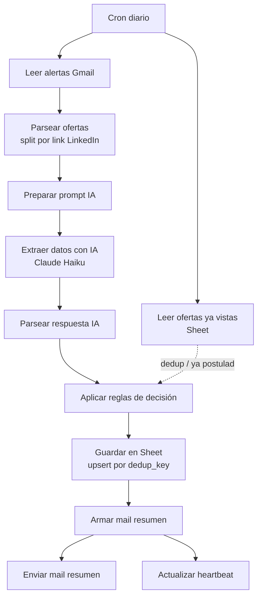

# Radar de empleos

Workflow n8n personal (no cliente Velar) que lee tus alertas de empleo de
Gmail, extrae los hechos de cada oferta con Claude, decide con reglas de
código si te conviene postular ya, mirar, o descartar — y te lo manda
resumido. No se postula solo. No scrapea LinkedIn: solo lee los mails de
alerta que vos ya configuraste.

## Qué hace

**Rama principal** (cron diario, 8am):



**Error workflow** (`workflow_error.json`): n8n lo dispara solo cuando
cualquier workflow que lo tenga configurado como Error Workflow falla.
Manda por Telegram: nombre del workflow, nodo que falló, mensaje de error.

**Heartbeat** (`workflow_heartbeat.json`): corre solo, cada hora. Si la
rama principal no escribió su marca de "corrí OK" en las últimas 26hs,
avisa por Telegram. Cubre el caso de que el cron se desactive o el
workflow quede roto sin tirar un error explícito.

**Ramas CV y seguimiento** (arquitectura original, todavía no
construidas): quedan para un paso posterior — avisar si se quieren ahora.

## El contrato de decisión, en una frase

El LLM (Claude Haiku, temperatura 0) solo extrae hechos del texto y nunca
inventa: todo lo que no está explícito en el mail queda `null`. Un Code
node en n8n (mirror de `reglas.js`, testeado con `node --test`) decide con
reglas legibles — DESCARTAR / POSTULAR YA / MIRAR, siempre con motivo. Un
dato ausente sobre competencia (postulantes, antigüedad del aviso) se trata
como incertidumbre, nunca como buena señal.

## Cómo importar

1. En n8n: Workflows → Import from File → los 3 `.json` de esta carpeta
   (`workflow_rama_principal.json`, `workflow_error.json`,
   `workflow_heartbeat.json`).
2. Cada uno trae un Sticky Note en la esquina superior izquierda con la
   lista puntual de qué reemplazar antes de activarlo — seguí eso primero.
3. En `workflow_rama_principal.json`, después de importar
   `workflow_error.json`, copiá su ID (aparece en la URL al abrirlo) y
   pegalo en Configuración del workflow → Error Workflow.
4. Activá los 3 workflows.

## Credenciales que necesita

Todas se crean en n8n (Credentials), nunca hardcodeadas en el JSON:

| Credencial | Tipo n8n | Para qué |
|---|---|---|
| Gmail | OAuth2 | leer alertas + mandar el mail resumen |
| Google Sheets | OAuth2 | leer/escribir el Sheet de ofertas y heartbeat |
| Anthropic | Header Auth (`x-api-key` = `={{ $env.ANTHROPIC_API_KEY }}`) | extracción con Claude Haiku |
| Telegram | Telegram API (bot token de @BotFather) | error workflow + heartbeat |

`ANTHROPIC_API_KEY` tiene que estar como variable de entorno del
contenedor n8n en el Docker Compose del VPS (no en el JSON) — la
credencial Header Auth solo referencia `$env.ANTHROPIC_API_KEY`.

## Esquema de la planilla

Ver [`esquema_planilla.md`](./esquema_planilla.md) — una hoja "Ofertas"
con las columnas que escribe el workflow más las que llenás vos a mano
(postulado, fecha, obligaciones pendientes), y una hoja "Heartbeat" con
2 columnas (`id`, `ultima_corrida`).

## Cómo cambio las reglas de decisión

Las reglas viven en dos lugares que tenés que mantener sincronizados:

1. `reglas.js` — la fuente de verdad, testeable sin n8n:
   ```
   node --test tests/
   ```
   Cambiá el umbral o la condición ahí, corré los tests, confirmá que los
   10 casos siguen pasando (o ajustá los tests si el cambio de
   comportamiento es intencional).
2. El Code node **"Aplicar reglas de decisión"** dentro de
   `workflow_rama_principal.json` — es un mirror manual del mismo código.
   No hay forma de que n8n importe `reglas.js` directamente sin montar el
   repo como volumen en el contenedor y habilitar
   `NODE_FUNCTION_ALLOW_EXTERNAL` en el Docker Compose del VPS. Si en
   algún momento se hace esa migración, este paso desaparece.

Los umbrales que más vas a querer tocar están todos arriba de
`reglas.js`: `MAX_ANIOS_TOLERADO`, `MAX_POSTULANTES_BAJA_COMPETENCIA`,
`MAX_ANTIGUEDAD_HORAS_BAJA_COMPETENCIA`, `MIN_COINCIDENCIAS_STACK`,
`CANDIDATO_STACK`, `TERMINOS_EXCLUYEN_PERFIL`.

El prompt de extracción (lo que el LLM ve) está en
[`prompts/extraccion_oferta.md`](./prompts/extraccion_oferta.md), también
mirroreado dentro del Code node **"Preparar prompt IA"**. Si lo cambiás,
volvé a resolver a mano los 2 ejemplos de
[`prompts/ejemplos_resueltos.md`](./prompts/ejemplos_resueltos.md) para
tener algo fijo contra qué validar.

## Qué NO detecta

- **Nada que no venga en el mail de alerta.** No scrapea LinkedIn, no
  visita el link de la oferta. Si LinkedIn no incluye "postulantes" o
  "publicado hace X" en el mail, esos campos quedan `null` para siempre en
  ese aviso — las reglas los tratan como incierto, no como "poca
  competencia".
- **El split de "Parsear ofertas" es una asunción sin validar contra un
  mail real.** Separa por links `/jobs/view/` de LinkedIn; si el formato
  de tu alerta es distinto (digest semanal, otro proveedor tipo We Work
  Remotely/Remotive), este nodo hay que reescribirlo.
- **Coincidencia de stack es un conteo simple** (cuántas tecnologías de
  `CANDIDATO_STACK` aparecen en el texto de la oferta, mínimo 2), no un
  análisis semántico. Un aviso que pida "backend" sin nombrar tecnologías
  puntuales no va a matchear aunque sea tu perfil exacto.
- **No arma el CV ni la carta de presentación** — eso es la rama CV,
  todavía no construida.
- **No trackea la postulación después de que la marcás en el Sheet más
  allá de avisar por fecha** — eso es la rama de seguimiento, tampoco
  construida todavía.
- **El heartbeat depende de que la rama principal llegue al nodo final**
  ("Actualizar heartbeat"). Si el workflow completo se desactiva en n8n
  (no falla, directamente no corre), no hay error que dispare el Error
  Workflow — el heartbeat es lo único que lo detecta, y tarda hasta 26hs.
