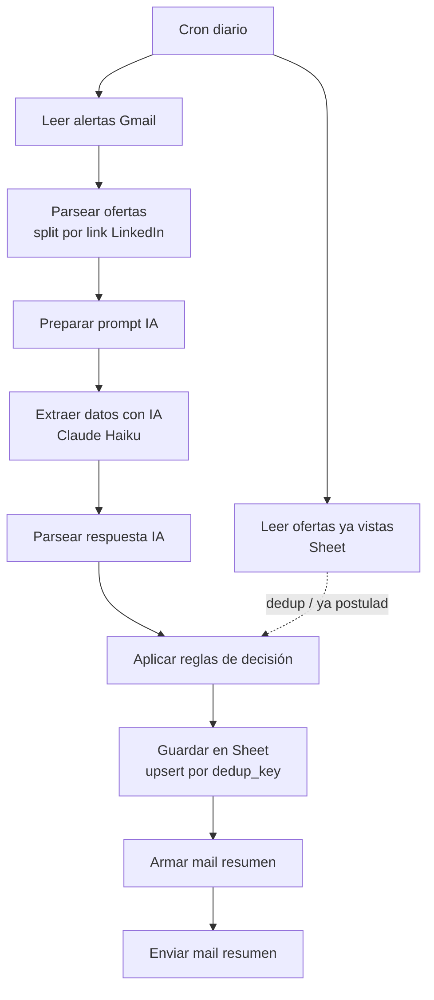

# Radar de empleos

Un workflow n8n que lee tus alertas de empleo de Gmail, extrae los hechos
de cada oferta con Claude, y decide con reglas de código si te conviene
postular ya, mirar, o descartar — y te lo manda resumido por mail. No se
postula solo. No scrapea LinkedIn: solo lee los mails de alerta que vos
ya configuraste.

## Qué hace

El LLM (Claude Haiku, temperatura 0) solo extrae hechos del texto y nunca
inventa: todo lo que no está explícito en el mail queda `null`. Un Code
node (mirror de `reglas.js`, testeado con `node --test`) decide con
reglas legibles — DESCARTAR / POSTULAR YA / MIRAR, siempre con motivo. Un
dato ausente sobre competencia (postulantes, antigüedad del aviso) se
trata como incertidumbre, nunca como buena señal.

## Cómo importar

1. n8n → Workflows → Import from File → `workflow.json`.
2. El Sticky Note de la esquina superior izquierda lista qué reemplazar.
3. Reemplazar `TU_SHEET_ID_AQUI` (2 nodos), crear credenciales, poner tu
   mail en "Enviar mail resumen", ajustar la label Gmail.
4. Activar.

## Credenciales que necesita

Todas se crean en n8n (Credentials), nunca hardcodeadas en el JSON:

| Credencial | Tipo n8n | Para qué |
|---|---|---|
| Gmail | OAuth2 | leer alertas + mandar el mail resumen |
| Google Sheets | OAuth2 | leer/escribir el Sheet de ofertas |
| Anthropic | Header Auth (`x-api-key` = `={{ $env.ANTHROPIC_API_KEY }}`) | extracción con Claude Haiku |

`ANTHROPIC_API_KEY` va como variable de entorno del contenedor n8n en el
Docker Compose del VPS, no en el JSON.

## Esquema de la planilla

Ver [`esquema_planilla.md`](./esquema_planilla.md).

## Cómo cambio las reglas de decisión

Las reglas viven en dos lugares que hay que mantener sincronizados:

1. `reglas.js` — la fuente de verdad, testeable sin n8n: `node --test tests/`
2. El Code node **"Aplicar reglas de decisión"** dentro de `workflow.json`
   — mirror manual del mismo código (n8n no puede requerir el archivo del
   repo sin bind-mount + `NODE_FUNCTION_ALLOW_EXTERNAL` en el Docker
   Compose del VPS, no se hizo esa mudanza).

Umbrales editables arriba de `reglas.js`: `MAX_ANIOS_TOLERADO`,
`MAX_POSTULANTES_BAJA_COMPETENCIA`, `MAX_ANTIGUEDAD_HORAS_BAJA_COMPETENCIA`,
`MIN_COINCIDENCIAS_STACK`, `CANDIDATO_STACK`, `TERMINOS_EXCLUYEN_PERFIL`.

El prompt de extracción está en
[`prompts/extraccion_oferta.md`](./prompts/extraccion_oferta.md), también
mirroreado en el Code node "Preparar prompt IA". Si lo cambiás, volvé a
resolver a mano los 2 ejemplos de
[`prompts/ejemplos_resueltos.md`](./prompts/ejemplos_resueltos.md).

## Qué NO detecta

- **Nada que no venga en el mail de alerta.** No scrapea LinkedIn, no
  visita el link de la oferta. Si el mail no trae "postulantes" o
  "publicado hace X", esos campos quedan `null` para siempre en ese
  aviso — las reglas los tratan como incierto, no como poca competencia.
- **El split de "Parsear ofertas" es una asunción sin validar contra un
  mail real** — separa por links `/jobs/view/` de LinkedIn.
- **Coincidencia de stack es un conteo simple** (mínimo 2 tecnologías de
  `CANDIDATO_STACK` en el texto), no análisis semántico.
- **No trackea nada después de guardarse en el Sheet.** Marcar `postulado`
  es manual; no hay avisos de seguimiento de entrevistas ni chequeo de que
  el workflow siga corriendo — si eso hace falta más adelante, se agrega
  aparte.
