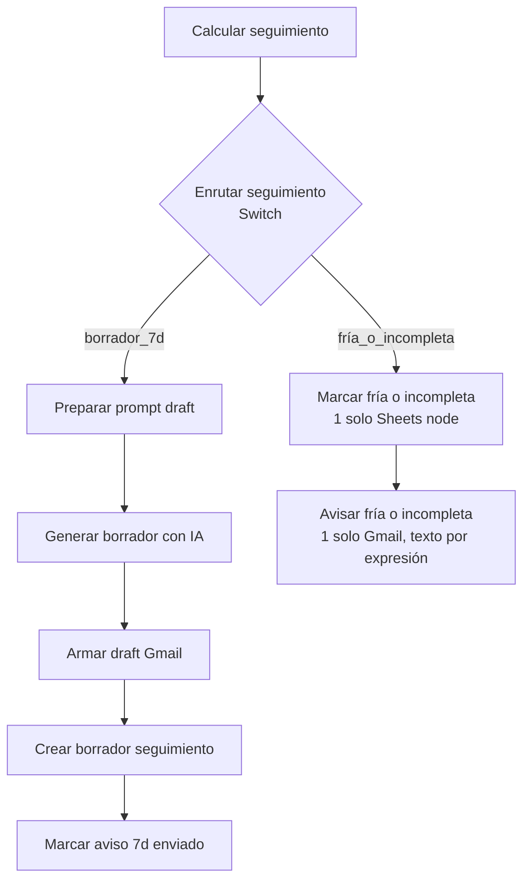
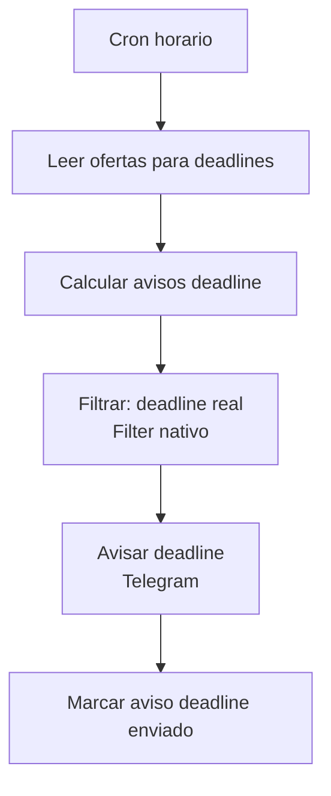
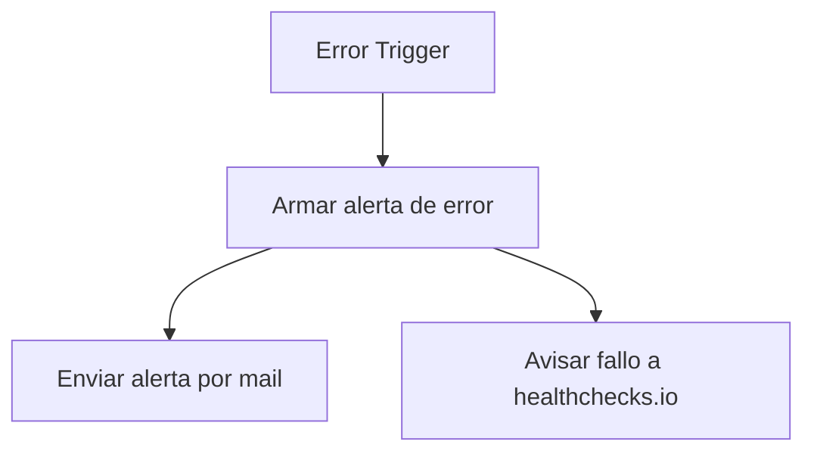

# Radar de empleos

Un workflow n8n que lee tus alertas de empleo de Gmail (LinkedIn, Indeed,
Computrabajo, Bumeran), extrae los hechos de cada oferta con Claude, y
decide con reglas de código si te conviene postular ya, mirar, o
descartar — y te lo manda resumido por mail. Además hace seguimiento de
lo que ya postulaste: borrador de mail a los 7 días sin respuesta, marca
"fría" a los 14, y avisos por Telegram antes de una entrevista o prueba
técnica con fecha límite. No se postula solo, no manda mails solo (todo
lo que "envía" en tu nombre queda como borrador). No scrapea ningún
sitio: solo lee los mails de alerta que vos ya configuraste en cada uno.

## Qué hace

`Parsear ofertas` distingue la fuente por remitente y usa un separador de
ofertas distinto para cada una — ver el comentario del Code node para el
detalle y las asunciones sin validar todavía (Bumeran especialmente).

**Rama de seguimiento** (cuelga del mismo Cron diario, corre después de
"Leer ofertas ya vistas"): sobre las filas con `postulado = true`, calcula
qué avisos corresponden hoy con una función pura testeada
(`seguimiento.js`, mirror en el Code node "Calcular seguimiento") y un
nodo **Switch nativo de n8n** enruta por el campo `accion` — sin Code
nodes de filtro duplicados. El modo dry-run no usa nodos de log: renombra
`accion` a `reporte_dry_run`, el Switch no tiene regla para ese valor y
`fallbackOutput: none` lo descarta solo (para ver qué hubiera pasado, se
mira el output de "Calcular seguimiento" en el panel de ejecución de n8n,
que conserva `accion_real`):

"Marcar fría o incompleta" es un único nodo Sheets para las 2 acciones:
la columna que no le corresponde a esa fila se reescribe con el mismo
valor que ya tenía (`estado_actual`/`incompleta_actual`, no-op real) en
vez de dejarla en blanco.

**Rama de deadlines** (72h/24h/6h antes de una obligación con
`fecha_limite`): tiene su **propio Schedule Trigger horario**, separado
del Cron diario de 8am — un chequeo una vez al día no puede detectar con
precisión "faltan 6 horas". Mismo Sheet, mismo Telegram, mismo workflow:

Workflow separado (`error-handler.json`), sin cron propio, disparado por
n8n cuando el workflow de arriba falla:

El LLM (Claude Haiku, temperatura 0) solo extrae hechos del texto y nunca
inventa: todo lo que no está explícito en el mail queda `null`. Un Code
node (mirror de `reglas.js`, testeado con `node --test`) decide con
reglas legibles — DESCARTAR / POSTULAR YA / MIRAR / NO_PARSEABLE, siempre
con motivo. Un dato ausente sobre competencia (postulantes, antigüedad
del aviso) se trata como incertidumbre, nunca como buena señal.

## Cómo importar

1. n8n → Workflows → Import from File → `workflow.json` y por separado
   `error-handler.json`.
2. El Sticky Note de cada workflow lista qué reemplazar — seguilo en
   orden, son 9 pasos en el principal.
3. En "Radar de empleos" → Settings (⚙️) → Error Workflow → elegir
   "Radar de empleos — Error Handler" (tiene que estar ya importado).
4. Crear un check en [healthchecks.io](https://healthchecks.io) (free
   tier): período 24hs, gracia 2hs — si no llega ping en 26hs manda
   alerta por mail solo. Pegar el UUID del check en los 2 nodos HTTP
   Request que dicen `TU_HEALTHCHECKS_UUID_AQUI` (uno en cada workflow).
   Vive en su infraestructura, no en tu VPS — si Contabo se cae entero
   igual te avisa.
5. Activar los dos workflows.

## Credenciales que necesita

Todas se crean en n8n (Credentials), nunca hardcodeadas en el JSON:

| Credencial | Tipo n8n | Para qué |
|---|---|---|
| Gmail | OAuth2 | leer alertas + mandar mails (resumen, error, seguimiento) + crear borradores de seguimiento |
| Google Sheets | OAuth2 | leer/escribir el Sheet de ofertas |
| Anthropic | Header Auth (`x-api-key` = `={{ $env.ANTHROPIC_API_KEY }}`) | extracción con Claude Haiku + redacción de borradores de seguimiento |
| Telegram | Telegram API (bot token) | avisos de deadline (72h/24h/6h antes de una obligación) |

`ANTHROPIC_API_KEY` va como variable de entorno del contenedor n8n en el
Docker Compose del VPS, no en el JSON. Ninguna API key **aparece en texto
plano** en ninguno de los dos workflow JSON de este repo — solo hay
referencias a credenciales por id interno de n8n (no sirven fuera de tu
instancia).

Variables de entorno adicionales para la rama de seguimiento (mismo
Docker Compose, junto a `ANTHROPIC_API_KEY`):

| Variable | Para qué |
|---|---|
| `TELEGRAM_CHAT_ID` | a qué chat le llegan los avisos de deadline |
| `RADAR_SEGUIMIENTO_DRY_RUN` | `true` = calcula qué avisos mandaría (7d/14d/72h/24h/6h) y los imprime en el log de ejecución de n8n, sin crear borradores, sin mandar mails/Telegram, sin escribir en el Sheet. Dejar sin definir (o `false`) en producción |

## Cómo crear el bot de Telegram

1. Hablar con [@BotFather](https://t.me/BotFather) en Telegram, `/newbot`,
   elegir nombre. Te da un token — va en la credencial n8n "Telegram
   account" (tipo Telegram API), nunca en el JSON.
2. Mandarle cualquier mensaje al bot nuevo (ej. "hola") para que tenga un
   chat que leer.
3. Abrir `https://api.telegram.org/bot<TOKEN>/getUpdates` en el navegador,
   buscar `"chat":{"id": ...}` en la respuesta — ese número es
   `TELEGRAM_CHAT_ID`.

## Resiliencia y costo

- **Tope de seguridad:** `MAX_OFERTAS_POR_CORRIDA` (default 30) en el
  Code node "Aplicar tope de seguridad". Si un día se detectan más, se
  procesan solo las primeras N y el mail resumen avisa cuántas quedaron
  afuera para revisar a mano.
- **Retry a Claude:** 4 intentos, 3s de espera fija entre cada uno
  (n8n no soporta backoff exponencial nativo en el campo de retry del
  HTTP Request node — esto es un retry con intervalo fijo, no
  matemáticamente exponencial; para este volumen es suficiente), timeout
  de 30s. Cubre 429 (rate limit) y 529 (sobrecarga) igual que cualquier
  otro error de red.
- **Si la llamada a Claude falla tras agotar los reintentos** — o si
  responde pero el JSON no es válido — la oferta no se pierde: queda en
  el Sheet con `estado = NO_PARSEABLE` y aparece en una sección aparte
  del mail resumen, con el link para revisar a mano.
- **Aislamiento por ítem:** los Code nodes de la cadena de negocio
  (`Parsear ofertas`, `Preparar prompt IA`, `Aplicar reglas de
  decisión`, `Armar mail resumen`) tienen `onError:
  continueRegularOutput` + try/catch interno — si una oferta puntual
  tiene datos raros, esa oferta se marca y sigue, no se cae la corrida.
  Los nodos de Gmail/Sheets (escritura real) se dejan sin ese flag a
  propósito: si fallan, tienen que frenar la corrida y avisar por el
  Error Workflow — silenciarlos ahí escondería una escritura que
  realmente no pasó.

## Esquema de la planilla

Ver [`esquema_planilla.md`](./esquema_planilla.md).

## Cómo cambio las reglas de decisión

Las reglas viven en dos lugares que hay que mantener sincronizados:

1. `reglas.js` — la fuente de verdad, testeable sin n8n: `node --test tests/`
2. El Code node **"Aplicar reglas de decisión"** dentro de `workflow.json`
   — mirror manual del mismo código (n8n no puede requerir el archivo del
   repo sin bind-mount + `NODE_FUNCTION_ALLOW_EXTERNAL` en el Docker
   Compose del VPS, no se hizo esa mudanza).

Umbrales editables arriba de `reglas.js`: `MAX_ANIOS_TOLERADO`,
`MAX_POSTULANTES_BAJA_COMPETENCIA`, `MAX_ANTIGUEDAD_HORAS_BAJA_COMPETENCIA`,
`MIN_COINCIDENCIAS_STACK`, `CANDIDATO_STACK`, `TERMINOS_EXCLUYEN_PERFIL`.

`tests/reglas.test.js` tiene 13 casos, entre ellos los bordes que importan
para no romper nada al tocar una regla: oferta duplicada por 2 alertas con
formato distinto de empresa (test 3), misma empresa con puesto distinto —
no es duplicado (test 11), sin ningún dato de competencia (test 2/9),
y respuesta del modelo inválida (test 12/13).

### Por qué no hay un nodo Merge para la deduplicación

El dedup contra "Leer ofertas ya vistas" no usa un nodo Merge de n8n a
propósito. Un Merge empareja o combina dos listas de tamaños relacionados
1 a 1 (o las une); acá son dos cosas de tamaño no relacionado — N ofertas
nuevas del mail contra M filas históricas del Sheet — y lo que hace falta
es una tabla de lookup completa disponible para cada ítem, no un
emparejamiento. Por eso "Aplicar reglas de decisión" referencia
directamente `$('Leer ofertas ya vistas').all()` dentro del Code node:
en n8n eso funciona aunque el nodo no esté conectado por la línea
principal, porque ejecutó en la misma corrida (ambas ramas cuelgan del
mismo Cron). Un Merge ahí generaría combinaciones cruzadas incorrectas.

El prompt de extracción está en
[`prompts/extraccion_oferta.md`](./prompts/extraccion_oferta.md), también
mirroreado en el Code node "Preparar prompt IA". Si lo cambiás, volvé a
resolver a mano los 2 ejemplos de
[`prompts/ejemplos_resueltos.md`](./prompts/ejemplos_resueltos.md).

## Qué NO detecta

- **Nada que no venga en el mail de alerta.** No scrapea ningún sitio, no
  visita el link de la oferta. Si el mail no trae "postulantes" o
  "publicado hace X", esos campos quedan `null` para siempre en ese
  aviso — las reglas los tratan como incierto, no como poca competencia.
- **El split de "Parsear ofertas" por Indeed/Computrabajo se validó
  contra mails reales del 2026-08-28, pero los NOMBRES DE CAMPO exactos
  que devuelve el nodo Gmail de n8n (`from`, `subject`, `textHtml`) son
  una asunción sin confirmar en esta instancia** — revisar la primera
  ejecución real. El de **Bumeran no está implementado**: cae a
  `error_parseo_mail` a propósito (necesita el html del mail, no
  disponible todavía) en vez de una fecha/estructura inventada.
- **ZonaJobs no está sumado.** No tenía alerta configurada al momento de
  escribir esto — agregar el remitente a "Leer alertas Gmail" y un caso
  al dispatcher de "Parsear ofertas" cuando se configure.
- **Coincidencia de stack es un conteo simple** (mínimo 2 tecnologías de
  `CANDIDATO_STACK` en el texto), no análisis semántico.
- **El seguimiento post-postulación es por día calendario, no por hora
  exacta** — "7 días" se cuenta a medianoche UTC, no a la hora exacta en
  que se cargó `fecha_postulacion`. Los avisos de deadline (72h/24h/6h) sí
  son horarios, por eso tienen su propio cron cada 1 hora.
- **Si `avisos_enviados` se edita a mano mal** (typo en el código, coma de
  más) puede reenviar un aviso ya mandado o saltearse uno — es texto
  libre, no hay validación de formato en el Sheet.
- **El retry a Claude es de intervalo fijo, no exponencial de verdad**
  (ver sección "Resiliencia y costo"). Si Anthropic tiene una caída larga,
  el workflow igual va a agotar los 4 intentos rápido y esas ofertas caen
  en `NO_PARSEABLE`.
- **El filtro Gmail (`newer_than:1d`) es una ventana fija, no un
  "desde la última corrida exitosa".** Si el cron se saltea un día
  entero, ese hueco de tiempo no se recupera solo — el respaldo real es
  que si esos mails siguen en la bandeja, se van a volver a leer al
  correr de nuevo (la deduplicación por empresa+puesto evita
  reprocesarlos como si fueran nuevos otra vez en el Sheet, pero si ya
  salieron de la ventana de 1 día no se vuelven a ver).
- **Un mail con formato de texto totalmente inesperado** (no es HTML/texto
  plano reconocible) no tira la corrida — pero tampoco se salta el llamado
  a Claude, así que gasta una llamada con texto vacío/no useful antes de
  terminar como `MIRAR` por falta de stack. Costo marginal, no bug.
- **No hay backoff exponencial matemático**, es retry con espera fija —
  ver limitación arriba.
