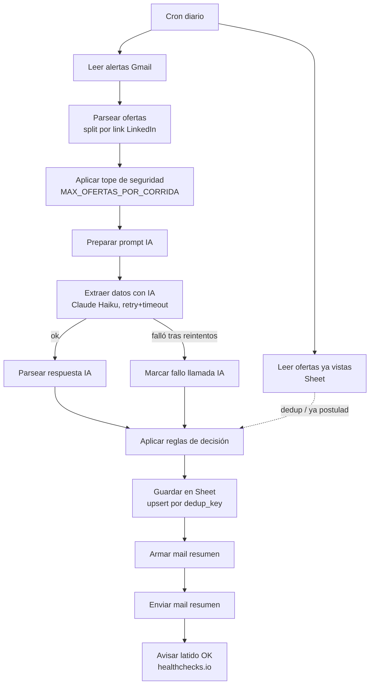
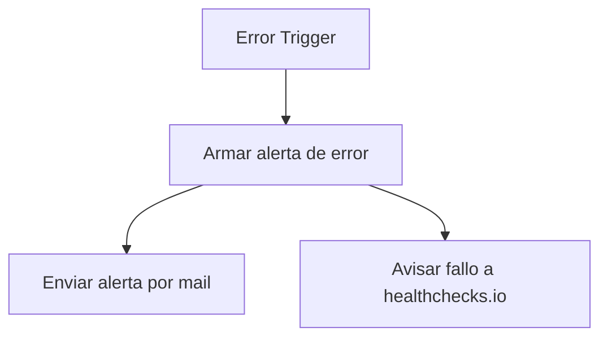

# Radar de empleos

Un workflow n8n que lee tus alertas de empleo de Gmail, extrae los hechos
de cada oferta con Claude, y decide con reglas de código si te conviene
postular ya, mirar, o descartar — y te lo manda resumido por mail. No se
postula solo. No scrapea LinkedIn: solo lee los mails de alerta que vos
ya configuraste.

## Qué hace

Workflow separado (`error-handler.json`), sin cron propio, disparado por
n8n cuando el workflow de arriba falla:

El LLM (Claude Haiku, temperatura 0) solo extrae hechos del texto y nunca
inventa: todo lo que no está explícito en el mail queda `null`. Un Code
node (mirror de `reglas.js`, testeado con `node --test`) decide con
reglas legibles — DESCARTAR / POSTULAR YA / MIRAR / NO_PARSEABLE, siempre
con motivo. Un dato ausente sobre competencia (postulantes, antigüedad
del aviso) se trata como incertidumbre, nunca como buena señal.

## Cómo importar

1. n8n → Workflows → Import from File → `workflow.json` y por separado
   `error-handler.json`.
2. El Sticky Note de cada workflow lista qué reemplazar — seguilo en
   orden, son 9 pasos en el principal.
3. En "Radar de empleos" → Settings (⚙️) → Error Workflow → elegir
   "Radar de empleos — Error Handler" (tiene que estar ya importado).
4. Crear un check en [healthchecks.io](https://healthchecks.io) (free
   tier): período 24hs, gracia 2hs — si no llega ping en 26hs manda
   alerta por mail solo. Pegar el UUID del check en los 2 nodos HTTP
   Request que dicen `TU_HEALTHCHECKS_UUID_AQUI` (uno en cada workflow).
   Vive en su infraestructura, no en tu VPS — si Contabo se cae entero
   igual te avisa.
5. Activar los dos workflows.

## Credenciales que necesita

Todas se crean en n8n (Credentials), nunca hardcodeadas en el JSON:

| Credencial | Tipo n8n | Para qué |
|---|---|---|
| Gmail | OAuth2 | leer alertas + mandar el mail resumen + mandar la alerta de error |
| Google Sheets | OAuth2 | leer/escribir el Sheet de ofertas |
| Anthropic | Header Auth (`x-api-key` = `={{ $env.ANTHROPIC_API_KEY }}`) | extracción con Claude Haiku |

`ANTHROPIC_API_KEY` va como variable de entorno del contenedor n8n en el
Docker Compose del VPS, no en el JSON. La API key de Anthropic **nunca
aparece en texto plano** en ninguno de los dos workflow JSON de este
repo — solo hay una referencia a la credencial `httpHeaderAuth` por id
interno de n8n (no sirve fuera de tu instancia).

## Resiliencia y costo

- **Tope de seguridad:** `MAX_OFERTAS_POR_CORRIDA` (default 30) en el
  Code node "Aplicar tope de seguridad". Si un día se detectan más, se
  procesan solo las primeras N y el mail resumen avisa cuántas quedaron
  afuera para revisar a mano.
- **Retry a Claude:** 4 intentos, 3s de espera fija entre cada uno
  (n8n no soporta backoff exponencial nativo en el campo de retry del
  HTTP Request node — esto es un retry con intervalo fijo, no
  matemáticamente exponencial; para este volumen es suficiente), timeout
  de 30s. Cubre 429 (rate limit) y 529 (sobrecarga) igual que cualquier
  otro error de red.
- **Si la llamada a Claude falla tras agotar los reintentos** — o si
  responde pero el JSON no es válido — la oferta no se pierde: queda en
  el Sheet con `estado = NO_PARSEABLE` y aparece en una sección aparte
  del mail resumen, con el link para revisar a mano.
- **Aislamiento por ítem:** los Code nodes de la cadena de negocio
  (`Parsear ofertas`, `Preparar prompt IA`, `Aplicar reglas de
  decisión`, `Armar mail resumen`) tienen `onError:
  continueRegularOutput` + try/catch interno — si una oferta puntual
  tiene datos raros, esa oferta se marca y sigue, no se cae la corrida.
  Los nodos de Gmail/Sheets (escritura real) se dejan sin ese flag a
  propósito: si fallan, tienen que frenar la corrida y avisar por el
  Error Workflow — silenciarlos ahí escondería una escritura que
  realmente no pasó.

## Esquema de la planilla

Ver [`esquema_planilla.md`](./esquema_planilla.md).

## Cómo cambio las reglas de decisión

Las reglas viven en dos lugares que hay que mantener sincronizados:

1. `reglas.js` — la fuente de verdad, testeable sin n8n: `node --test tests/`
2. El Code node **"Aplicar reglas de decisión"** dentro de `workflow.json`
   — mirror manual del mismo código (n8n no puede requerir el archivo del
   repo sin bind-mount + `NODE_FUNCTION_ALLOW_EXTERNAL` en el Docker
   Compose del VPS, no se hizo esa mudanza).

Umbrales editables arriba de `reglas.js`: `MAX_ANIOS_TOLERADO`,
`MAX_POSTULANTES_BAJA_COMPETENCIA`, `MAX_ANTIGUEDAD_HORAS_BAJA_COMPETENCIA`,
`MIN_COINCIDENCIAS_STACK`, `CANDIDATO_STACK`, `TERMINOS_EXCLUYEN_PERFIL`.

`tests/reglas.test.js` tiene 13 casos, entre ellos los bordes que importan
para no romper nada al tocar una regla: oferta duplicada por 2 alertas con
formato distinto de empresa (test 3), misma empresa con puesto distinto —
no es duplicado (test 11), sin ningún dato de competencia (test 2/9),
y respuesta del modelo inválida (test 12/13).

### Por qué no hay un nodo Merge para la deduplicación

El dedup contra "Leer ofertas ya vistas" no usa un nodo Merge de n8n a
propósito. Un Merge empareja o combina dos listas de tamaños relacionados
1 a 1 (o las une); acá son dos cosas de tamaño no relacionado — N ofertas
nuevas del mail contra M filas históricas del Sheet — y lo que hace falta
es una tabla de lookup completa disponible para cada ítem, no un
emparejamiento. Por eso "Aplicar reglas de decisión" referencia
directamente `$('Leer ofertas ya vistas').all()` dentro del Code node:
en n8n eso funciona aunque el nodo no esté conectado por la línea
principal, porque ejecutó en la misma corrida (ambas ramas cuelgan del
mismo Cron). Un Merge ahí generaría combinaciones cruzadas incorrectas.

El prompt de extracción está en
[`prompts/extraccion_oferta.md`](./prompts/extraccion_oferta.md), también
mirroreado en el Code node "Preparar prompt IA". Si lo cambiás, volvé a
resolver a mano los 2 ejemplos de
[`prompts/ejemplos_resueltos.md`](./prompts/ejemplos_resueltos.md).

## Qué NO detecta

- **Nada que no venga en el mail de alerta.** No scrapea LinkedIn, no
  visita el link de la oferta. Si el mail no trae "postulantes" o
  "publicado hace X", esos campos quedan `null` para siempre en ese
  aviso — las reglas los tratan como incierto, no como poca competencia.
- **El split de "Parsear ofertas" es una asunción sin validar contra un
  mail real** — separa por links `/jobs/view/` de LinkedIn.
- **Coincidencia de stack es un conteo simple** (mínimo 2 tecnologías de
  `CANDIDATO_STACK` en el texto), no análisis semántico.
- **No trackea nada después de guardarse en el Sheet.** Marcar `postulado`
  es manual; no hay avisos de seguimiento de entrevistas.
- **El retry a Claude es de intervalo fijo, no exponencial de verdad**
  (ver sección "Resiliencia y costo"). Si Anthropic tiene una caída larga,
  el workflow igual va a agotar los 4 intentos rápido y esas ofertas caen
  en `NO_PARSEABLE`.
- **El filtro Gmail (`newer_than:1d`) es una ventana fija, no un
  "desde la última corrida exitosa".** Si el cron se saltea un día
  entero, ese hueco de tiempo no se recupera solo — el respaldo real es
  que si esos mails siguen en la bandeja, se van a volver a leer al
  correr de nuevo (la deduplicación por empresa+puesto evita
  reprocesarlos como si fueran nuevos otra vez en el Sheet, pero si ya
  salieron de la ventana de 1 día no se vuelven a ver).
- **Un mail con formato de texto totalmente inesperado** (no es HTML/texto
  plano reconocible) no tira la corrida — pero tampoco se salta el llamado
  a Claude, así que gasta una llamada con texto vacío/no useful antes de
  terminar como `MIRAR` por falta de stack. Costo marginal, no bug.
- **No hay backoff exponencial matemático**, es retry con espera fija —
  ver limitación arriba.
